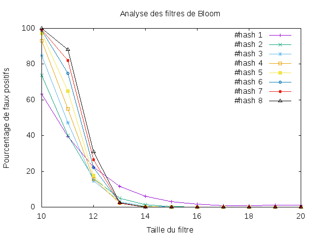

---------------
 tp-bloom
---------------
Salah Zakaria OUAICHOUCHE Groupe3

.. toctree::
   :maxdepth: 1

   bloomfilter.rst

~~~~~~~~~~
Etat du TP
~~~~~~~~~~

Toute les Question de TP traiter 

~~~~~~~~~~~~~~~~~~~~~~
Réponses aux questions
~~~~~~~~~~~~~~~~~~~~~~

Question 4.2.3
--------------

Un faux positif a été détecté lorsque la taille de la table était de 2^3. 

Question 4.3.4
--------------
Commentaire:
............

On peut constater que:
- Lorsque la table du filtre est petite : Plus le nombre de fonctions de hachage est grand, plus il y a de faux positifs (cf droite verticale)

- Lorsque la table du filtre augmente : La tendance d'inverse, Plus le nombre de fonctions de hachage est grand, moins il y a de faux positifs (croisement des droites)

.. _fig:tp4.png:

